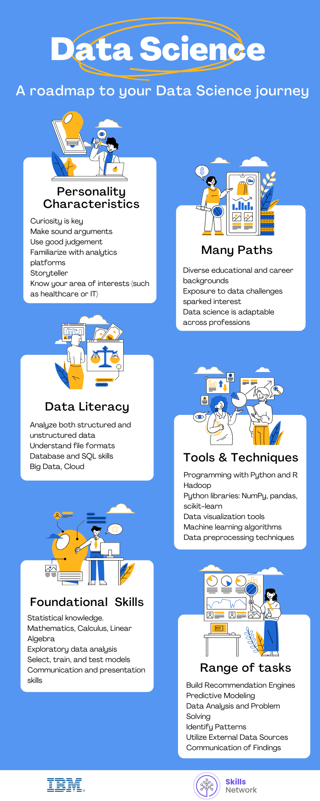
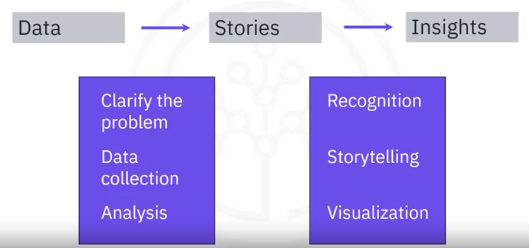

# MACHINE LEARNING

https://www.youtube.com/watch?v=JcI5Vnw0b2c&list=PLQVvvaa0QuDfKTOs3Keq_kaG2P55YRn5v&index=2

## Glossary

ML = Machine Learning

Adobe Spark: A suite of software tools that allow users to create and share visual content such as graphics, web pages, and videos.

Big Data Cluster: A distributed computing environment comprising thousands or tens of thousands of interconnected computers that collectively store and process large datasets.

Chief Data Officer (CDO): An emerging role responsible for overseeing data-related initiatives, governance, and strategies, ensuring that data plays a central role in digital transformation efforts.

Data clusters: A group of similar, related data points distinct from other clusters.

Delimited text file: A plain text file where a specific character separates the data values.

Hadoop: An open-source framework designed to store and process large datasets across clusters of computers.

Model: A representation of the relationships and patterns found in data to make predictions or analyze complex systems retaining essential elements needed for analysis.

Nearest neighbor: A machine learning algorithm that predicts a target variable based on its similarity to other values in the dataset.

Neural networks: A computational model used in deep learning that mimics the structure and functioning of the human brain’s neural pathways. It takes an input, processes it using previous learning, and produces an output.

NoSQL databases: Databases are designed to store and manage unstructured data and provide analysis tools for examining this type of data.

Online Transaction Processing (OLTP) Systems: Systems that focus on handling business transactions and storing structured data.

Recommendation engine: A computer program that analyzes user input, such as behaviors or preferences, and makes personalized recommendations based on that analysis.

Regression: A statistical model that shows a relationship between one or more predictor variables with a response variable.

Stata: A software package used for statistical analysis.

Synthetic Data: Artificially generated data with properties similar to real data, used by data scientists to augment their datasets and improve model training.

Tabular data: Data that is organized into rows and columns.

# (1) WHAT IS DATA SCIENCE?

Data science is the field of exploring, manipulating, and analyzing data, and using data to answer questions or make recommendations.

Data science can help organizations:

- Understand their enviroments
- Analyze existing issues
- Reveal previously hidden opportunities

Many organizations will use data science to focus on an specific problem, and so it’s essential to clarify the question that the organization wants answered. This is the First step for the data science project.

The next question is: What data do we need to solve the problem?, and Where will that data come from?

A data scientist should be:

- Curious
- Judgemental
- Argumentative

The data scientist role in an organization:

### File formats

A data format is how data is encoded so it can be stored within a data file type.

- Comma-separated values (CSV) / Tab-separated values (TSV). Commonly used format for storing tabular data as plain text where either the comma or the tab separates each value.
- Microsoft Excel Open XML Spreadsheet, or XLSX
- Extensible Markup Language, or XML. A language designed to structure, store, and enable data exchange between various technologies. It’s a markup language with set rules for encoding data
- Portable Document Format, or PDF
- JavaScript Object Notation, or JSON. Text-based open standard designed for transmitting structured data over the web. Considered as one of the best tools for sharing data.

## BIG DATA AND DATA MINING

Digital transformation is not simply duplicating existing processes in digital form; the in-depth analysis of how the business operates helps organizations discover how to improve their processes and operations, and harness the benefits of integrating data science into their workflows.

### Cloud

Cloud computing, also referred to as the cloud, is the delivery of on-demand computing resources such as networks, servers, storage, applications, services, and data centers over the internet on a pay-for-use basis. Describe applications and data that users access over the Internet rather than locally.

Examples of cloud computing include:

- Online web apps.
- Secure online business applications
- Storing personal files on platforms such as Google Drive, OneDrive, and Dropbox.

The user benefits are:

- No need to purchase applications and install them on local computer
- Use online versions of applications and pay a monthly subscription
- More cost-effective
- Access most current software versions
- Save local storage space
- Work collaboratively in real time

It has 5 characteristics:

- On-demand self-service: access to processing, storage and network
- Broad network access: resources access via the Internet
- Resource pooling: Shared resources dynamically assigned
- Rapid elasticity: Automatically scales resource access
- Measured service: only pay for what you use or reserve.

It has 3 deployment models: A cloud deployment model indicate where the infrastructure resides, who owns and manages it, and how cloud resources and services are made available to users.

- Public
- Private
- Hybrid

 and it has 3 service models: Those are based on three layers in a computing stack

- Infrastucture: IaaS (Infrastucture as a Service). You can access the infrastucture and physical computing resources such as servers, networking, storage, and data center space without the need to manage or operate them
- Platform: PaaS (Platform as a Service). You can access the platform that comprises the hardware and software tools, that are usually needed to develop and deploy applicatons to users over the internet.
- Application: SaaS (Software as a Service). Software and applications are centrally hosted and licensed on a subscription basis. It is sometimes referred to as “on-demand software”

Some big tech companies offer cloud platforms

### Big Data

Refers to the dynamic, large and disparate volumes of data being created by people, tools and machines.

There are ceratin elements that are common accross the different definitios, there are the V’s of Big Data:

- Velocity: speed at which data accumulates.
- Volume: the scale of the data, or the increase in the amount of data stored. Drivers of volume are the increase in data sources, higher resolution sensors, and scalable infrastructure.
- Variety: diversity of the data. It also reflects that data comes from different sources, machines, people, and processes, both internal and external to organizations. Drivers are mobile technologies, social media, wearable technologies, Geo technologies, video, and many more.
- Veracity: Quality and origin of data. Drivers include cost, and the need for traceability.
- Value: our ability and need to turn data into value. Value isn’t just profit

### Big Data Processing Tools

The Big Data processing technologies provide ways to work with large sets of structured, semi-structured, and unstructured data so that value can be derived from big data. There are 3 open source technologies and the role they play in big data analytics.

- Hadoop: a collection of tools that provides distributed storage and processing of big data.
    - Java based open source framework
    - Allows distributed storage and processing of large datasets across clusters of computers
    - A node is a single computer
    - A collection of nodes forms a cluster.
    - Provides a reliable, scalable, and cost-effective solution for storing data with no format requirements.
    - One of the 4 main components of Hadoop is Hadoop Distributed File System, or HDFS, which is a storage system for big data that runs on multiple commodity hardware connected through a network.
        - It provides scalable and reliable big data storage by partitioning files over multiple nodes.
        - Splits large files across multiple computers, allowing parallel access to them.
        - Replicates file blocks on different nodes to prevent data loss, making it fault tolerant
    - Benefits of Hadoop include:
        - Better real-time data-driven decisions. Incorporates emerging data formats not traditionally used in data warehouses.
        - Improved data access and analysis.
        - Data offload and consolidation
- Hive: an open-source data warehouse for data query and analysis built on top of Hadoop. Since Hive is based on Hadoop, queries have high latency, which means Hive is less appropriate for applications that need very fast response time.
    - Read-based, and therefore not suitable for transaction processing that involves a high percentage of write operations.
    - Better suited for data warehousing tasks such as ETL, reporting, and data analysis.
    - Includes tools that enable easy access to data via SQL.
- Spark (apache): a distributed analytics framework for complex, real-time data analytics. It’s a general-purpose data processing engine designed to extract and process large volumes of data for a wide range of applications including interactive analytics, streams processing, Machine Learning, Data integration, and ETL.
    - Has in-memory processing which significantly increases speed of computations.
    - Provides interfaces for major programming languages such as Java, Scala, Python, R, and SQL
    - Can run using its standalone clustering technology
    - Can also run on top of other infrastructures, such as Hadoop
    - Can access data in a large variety of data sources, including HDFS and Hive, making it highly versatile.
    - Performs complex analytics in real-time.

### Data mining process

Data mining is the process of automatically searching and analyzing data, discovering previously unrevelaed patterns.

Big data requires a process called data mining to make use of:

1. Goal set. Identify key questions
2. Select data. Identify data sources
3. Preprocess. Clean the data
4. Transform. Determine storage needs
5. Data mine. Determine methods and analyze
6. Evaluate. Assess outcomes, share results.

## MACHINE LEARNING AND DEEP LEARNING

Data scientist use AI along with Big data to make predictions. Measurement is the first step for an organization to solve its problem using data.

Machine learning is a subset of AI that uses computer algorithms to analyze data and make intelligent decisions based on what it has learned, without being explicit programmed.

Machine learning algorithms:

- are trained with large sets of data
- They learn from expamples.
- They do not follow rules-based algorithms

Deep Learning is a specialized subset of machine learning that uses layered neural networks to simulate human decision-making. 

Deep learning algorithms:

- Can label and categorize information, and identify patterns.
- It is what enables AI systems to continuously learn on the job and improve the quality and accuracy of results

A Neuronal Network in AI, is a collection of small computing units called neurons, that take incoming data and learn to make decisions over time.  Neural networks are often layered-deep, and are the reason deep learning algorithms become more efficient as the data set increase in volume.

### Generative AI

It’s a subset of artificial intelligence that focuses on producing new data rather than just analyzing  existing data. It allows machine to create content, mimicking creations by people.

Deep Learning models like Generative Adversarial Networks (GANs), and Variational auto-encoders (VAEs) are the foundation of this technique. This models create new instances that replicate the underlying distribution of the original data, by learning patterns from enormous volumes of data.

Some of the applications of Generative AI are:

- Natural language processing like Open AIs, Chatgpt
- In Healthcare, it can synthesize medical images, aiding on the training of medical proffesionals
- Create unique and stunning art works, generating endless visual compositions.
- Developers can use it to create realistic enviroments, characters and game levels.

Data Scientist can argument their data set using Generative AI to create synthetic data and use it along with tth original data, for model training and testing. It creates this data with similar properties as the original data.

Some of the benefits of Generative AI are:

- Coding automation
- Uncover Insights, automate updates

### Regression

Identifies correlation between one or more inputs and an output

## UNDERSTANDING DATA

Data is unorganized information that is processed to make it meaningful. Generally, data comprises of facts, observations, perceptions, numbers, characters, symbols, and images that can be interpreted to derive meaning.

### Structured data

Data that is well organized in formats that can be stored in databases and lends itself to standard data analysis methods and tools. Structured data is objective facts and numbers that can be collected, exported, stored and organized in typical databases.

Sources could include:

- SQL databases
- OLTP systems (Online Transaction Processing)
- Spreadsheets
- Online forms
- Sensors GPS and RFID (Radio Frequency Identification)
- Network and Web server logs

### Semi-Structured data

Data that is somewhat organized and relies on meta tags for grouping and hierarchy. It has some organizational properties but lacks a fixed or rigid schema. It cannot be stored in the form of rows and columns as in databases.

Sources could include:

- E-mails
- XML and other markup languages. XML and JSON allow users to define tags and attributes to store data in a hierarchical form, and are used widely to store and exchange semi-structured data.
- Binary executables
- TCP/IP packets
- Zipped files
- Integration of data from different sources.

### Unstructured data

Data that is not conventionally organized in the form of rows and columns in a particular format. Unstructured data can deal with the heterogeneity of sources and has a variety of business intelligence and analytics applications. It can be stored in files and documents such as Word, for manual analysis, or in NoSQL databases that have their own analysis tools for examining this type of data.

Sources could include:

- Web pages
- Social media feeds
- Images in varied file formats
- Video and Audio files
- Documents and PDF files
- PowerPoint presentations
- Media logs
- Surveys

### Data Sources

SQL Server, Oracle, MySQL, IBM DB2, PostgreSQL are some examples of relational databases to store data in a structured way.

External to the organization, there are other publicly and privately available datasets, typically available as:

- flat files: store data in plain text format, with one record or row per line. Each value is separated by a delimiter, and the data maps to a single table. The most common flat file format is .CSV
- spreadsheet files: it’s a special type of flat files. It organize data in a tabular format (rows and columns).
- XML documents: Contain data values that are identified or marked up using tags. It can support complex data structures. Some common uses include online surveys, bank statements, and other unstructured data sets.

APIs and Web Services typically listen for incoming requests, which can be in the form of web requests from users or network requests from applications, and return data in plain text, XML, HTML, JSON, or media files.

Some popular examples of APIs are:

- Twitter and Facebook APIs for customer sentiment analysis.
- Stock Market APIs for trading and analysis.
- Data Lookup and Validation APIs, for cleaning and co-relating data.

Web Scraping is used to extract relevant data from unstructured sources. It makes pissible to download specific data based on defined parameters. Some of the popular web scraping tools are:

- BeautifulSoup
- Scrapy
- Pandas
- Selenium

## DATA LITERACY

### Data Collection and Organization

A data repository is a general term used to refer to data that has been collected, organized, and isolated so it can be used for business operations or mined for reporting and data analysis. Data repositories help to isolate data and make reporting and analytics more efficient and credible while also serving as a data archive. 

Some types of data repositories include:

- Databases. A Database Management System (DBMS) is a set of programs that creates and maintains the database. It allows you to store, modify, and extract information from the database using a function called querying. Even though a database and DBMS mean different things, the terms are often used interchangeably.
- Data Warehouses. It works as a central repository that merges information coming from disparate sources, and consolidates it through the ETL process, into one comprehensive database for analytics and business intelligence.
- Big Data Stores. It includes distributed computational and storage infrastructure to store, scale, and process very large data sets.

### Relational Database Management System (RDBMS)

A relational database is a collection of data organized into a table structure, where the tables can be linked, or related, based on data common to each. It uses SQL for querying data. 

Rows ar the “records”, and the columns are the “attributes”.

Relational databases build on the organizational principles of flat files such as spreadsheets, with data organized into rows and columns following a well-defined structure and schema.

Some advantages of Relational Databases are:

- Create meaningful information by joining tables.
- Flexibility to make changes while the database is in use.
- Minimize data redundancy by allowing relationships to be defined between tables.
- Offer export and import options that provide ease of backup and disaster recovery.
- Are ACID compliant (Atomicity, Consistency, Isolation, and Durability), ensuring accuracy and reliability in database transactions

# (9) MACHINE LEARNING WITH PYTHON

## Scikit-learn functions

## Supervised VS Unsupervised

| Supervised | Unsupervised |
| --- | --- |
| We “teach” the model, then, with that knowledge, it can predict unknown or future instances | The model works on its own to discover information that may not be visible to the human eye. |
| We teach the model by training it with some data from a labeled dataset. | The algorithm trains on the dataset and draws conclusions on unlabeled data. |
| The headers of each column are called attributes. The columns are called features, which include the data. |  |
| 2 types of supervised learning techniques: Regression and classification. | The techniques can be: Dimension reduction, density estimation, market basket analysis, clustering |

Classification: the process of predicting discrete class labels or categories.

Regression: the process of predicting continuous values, as opposed to predicting a categorical value in classification.

Clustering: is grouping of data points or objects that are somehow similar by:

- Discovering structure
- Summarization
- Anomaly detection

## Intro to Clustering

Customer segmentation is the practice of partitioning a customer based into groups of individuals that have similar characteristics. This strategy allows the business to target specific groups of customers, so as to more effectively allocate marketing resources. 

Customer segmentation is one of the popular usages of clustering.

Clustering can group data only unsupervised based on the similarity of customers to each other. 

1. It will partition your customers into mutually exclusive groups, named clusters. The data in each cluster are similar to each other. 
2. Now we can create a profile for each group, considering the common characteristics of each cluster. 
3. Finally, we can assign each individual in our dataset to one of these groups or segments of customers

Cluster analysis also has many other applications in different domains

### What is clustering?

Clustering means finding clusters in a dataset, unsupervised.

A cluster is a group of data points or group of objects that are similar to other objects in the cluster, and dissimilar to data points in other clusters.

### Clustering Vs. Classification

Classification algorithms predict categorical classed labels. This means assigning instances to predefined classes such as defaulted or not. Classification is a supervised learning where each training data instance belongs to a particular class.

In Clustering, the data is unlabeled, and the process is unsupervised. 

### Why clustering?

- Exploratory data analysis
- Summary generation or reducing the scale
- Outlier detection
- Finding duplicates
- Pre-processing step for either prediction, other data mining tasks, or as part of a complex system.

### Clustering algorithms

- Partitioned-based clustering: Group of clustering algorithms that produces sphere-like clusters, such as K-means, K-medians, or Fuzzy c-Means. These algorithms are relatively efficient and are used for medium and large sized databases
- Hierarchical clustering: Produce trees of clusters, such as Agglomerative, or divisive algorithms. These group of algorithms are very intuitive, and are generally good for use with small size datasets.
- Density-based clustering: Produces arbitrary shaped clusters, they are especially good when dealing with spacial clusters or when there is noise in your dataset. For example, the DBSCAN algorithm.

## K-Means Clustering

K-means is an algrithm that can group data only unsupervised, based on the similarity of customers to each other. 

K-means is a type of partitioning clustering, that is, it divides the data into K-non overlapping subsets or clusters without any cluster internal structure or labels.

Objects within a cluster are very similar, and objects across different clusters are very different or dissimilar.

For using K-means, we have to find similar samples, for example, similar customers.

Now we face a couple of key questions:

1. How can we find the similarity of samples in clustering
2. How do we measure how similar two customers are with regard to their demographics.

Though the objective of K-Means is to form clusters in such a way that similar samples go into a cluster, and dissimilar samples fall into different clusters, it can be shown that instead of a similarity metric, we can use dissimilarity metrics. In other words, conventionally, the distance of samples from each other is used to shape the clusters. So, we can say K-means tries to minimize the intra cluster distances and maximize the inter-cluster distances.